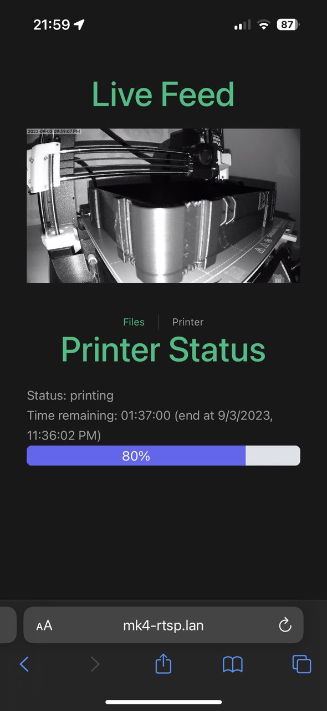
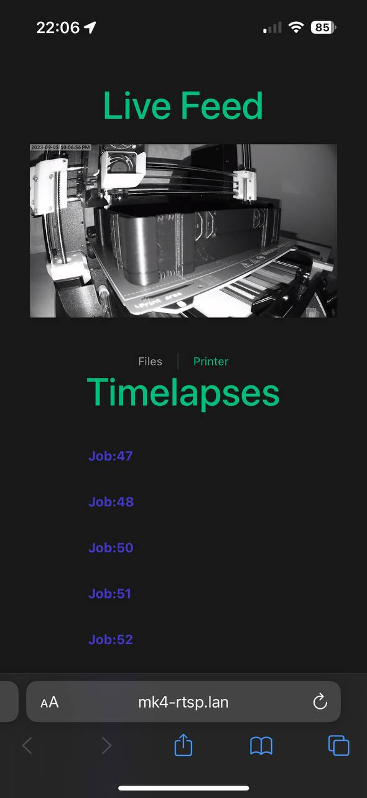

Prusa MK4 status + UniFi RTSP stream relay
==========================================

*Disclaimer: This is not close to production ready, but it's working for me ¯\\_(ツ)_/¯ *

## Features
- Display print progress stats with live stream of UniFi protect feed
- Create timelapses
- Notifications when print is done (via [NTFY](https://ntfy.sh/))

## How to run

1. Create the `./backend/.env` file 

- `DIGEST_AUTH` is the `user:password` for your MK4 printer, example:
`maker:pa$$w0rd`

- `NTFY_TOPIC` is the topic to which you have to subscribe on your phone to get
  notified, can be anything. See [NTFY](https://ntfy.sh/) for more details

- `RTSP_STREAM` is the link to you UniFi protect stream, can be obtained via the
  UniFi protect web app

2. Build and run via [Go-task](https://taskfile.dev/): `task back:serve`

- If you want to install/use go-Task, you can take a look at the `Taskfile.yml` to
manually issue the necessary commands

## Screenshots

